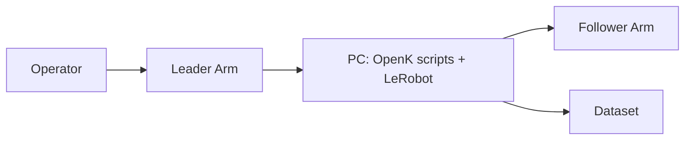
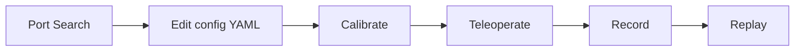

# OpenK on LeRobot

OpenK は、低コストなオープンソースロボットアームを `LeRobot` ベースで動かすためのリポジトリです。  
このリポジトリには、ハードウェア資産（CAD/STL/URDF）と、実行用スクリプト（テレオペ・記録・再生・キャリブレーション）が含まれています。

## DEMO

- 動作動画: https://github.com/user-attachments/assets/53bd0b76-32d7-4085-9f98-901ec6ca804d

## まず何ができる？

- Leader アームを操作して Follower アームを動かす（テレオペ）
- 操作データを記録する（データセット作成）
- 記録データを再生する（リプレイ）
- キャリブレーション・ポート探索などの運用ツールを使う

## 3分クイックスタート

### 1) セットアップ

前提:
- Python `3.10`
- `uv`（https://github.com/astral-sh/uv）

```bash
git clone <repo-url> OpenK
cd OpenK
uv venv .venv --python 3.10
```

Windows PowerShell:

```powershell
.venv\Scripts\Activate.ps1
```

Linux/macOS:

```bash
source .venv/bin/activate
```

```bash
uv pip install -e .
```

### 2) ポート確認

```bash
uv run python scripts/lerobot_find_port.py
```

出てきたポート名（例: `COM5` / `/dev/ttyACM0`）を控えます。

### 3) 設定ファイルを編集

- `config/teleop_example.yaml`
- `config/record_example.yaml`

上記の `teleop.port` と `robot.port` を、自分の環境のポートに変更します。

### 4) キャリブレーション

```bash
uv run python scripts/lerobot_calibrate.py --config_path=config/calibrate_openk_sts_leader.yaml
```

### 5) テレオペ開始

```bash
uv run python scripts/cleank_teleoperate.py --config_path=config/teleop_example.yaml
```

停止: `Ctrl + C`

## 主要コマンド早見表

| 目的 | コマンド |
|---|---|
| ポート探索 | `uv run python scripts/lerobot_find_port.py` |
| テレオペ | `uv run python scripts/cleank_teleoperate.py --config_path=config/teleop_example.yaml` |
| 記録 | `uv run python scripts/cleank_record.py --config_path=config/record_example.yaml` |
| リプレイ | `uv run python scripts/lerobot_replay.py --config_path=config/replay_follower2.yaml` |
| キャリブレーション | `uv run python scripts/lerobot_calibrate.py --config_path=config/calibrate_openk_sts_leader.yaml` |
| カメラ探索 | `uv run python scripts/lerobot_find_cameras.py` |
| 情報表示 | `uv run python scripts/lerobot_info.py` |

## リポジトリ構成（何がどこにあるか）

| パス | 内容 | 使うタイミング |
|---|---|---|
| `hardware/follower/OpenKSTEP.step` | Follower CAD（STEP） | 機械設計・3D確認 |
| `hardware/leader/small-leader.step` | Leader CAD（STEP） | 機械設計・3D確認 |
| `hardware/follower/robot.urdf` | Follower URDF | シミュレーション・モデル確認 |
| `hardware/follower/*.stl` / `hardware/leader/*.stl` | 3Dプリント用メッシュ | 製作時 |
| `config/*.yaml` | 実行設定（ポート、ID、fps など） | 実行前に編集 |
| `scripts/*.py` | 実行スクリプト本体 | 実行時 |
| `openk/` | ロボット実装 | 開発時 |
| `test/` | テスト | 変更確認時 |

## 可視化（READMEで全体を掴む）

### 構成図



### 典型フロー



## テスト

通常テスト:

```bash
UV_CACHE_DIR=.uv_cache uv run pytest
```

HIL テスト（任意、実機接続あり）:

```bash
OPENK_HIL=1 \
OPENK_FOLLOWER_PORT=/dev/ttyUSB0 \
OPENK_LEADER_PORT=/dev/ttyUSB1 \
UV_CACHE_DIR=.uv_cache uv run pytest test/test_cleank_hil.py -q
```

## よくある詰まりどころ

### 1) ポート接続エラー

- `lerobot_find_port.py` を再実行
- YAML 内 `teleop.port` / `robot.port` を再確認
- 別アプリが同じポートを掴んでいないか確認

### 2) インストール失敗

```bash
uv venv .venv --python 3.10
uv pip install -e .
```

仮想環境を作り直して再実行します。

### 3) 設定が反映されない

- 実行時の `--config_path=...` が意図したファイルか確認
- 同名の別ファイルを編集していないか確認

## STEP/URDF/STL リンク

- Follower STEP: https://github.com/CleanKDev/OpenK/blob/main/hardware/follower/OpenKSTEP.step
- Leader STEP: https://github.com/CleanKDev/OpenK/blob/main/hardware/leader/small-leader.step
- Follower URDF: https://github.com/CleanKDev/OpenK/blob/main/hardware/follower/robot.urdf

## Core Members

- [@sabamiso-rrsc](https://github.com/sabamiso-rrsc): ハードウェア、組み込み、DAMIAO初期化、ソフトウェア
- @UedaKenji: LeRobot統合、メインソフトウェア開発
- @shunyatadano: URDFおよびシミュレーション
- @shinshin0706, @Ryosuke520, @deBroglieeeen: 現場インテグレーション、HW/SW調整、シミュレーション

## 謝辞

- LeRobot by HuggingFace, Inc.
- SO-100 by TheRobotStudio
